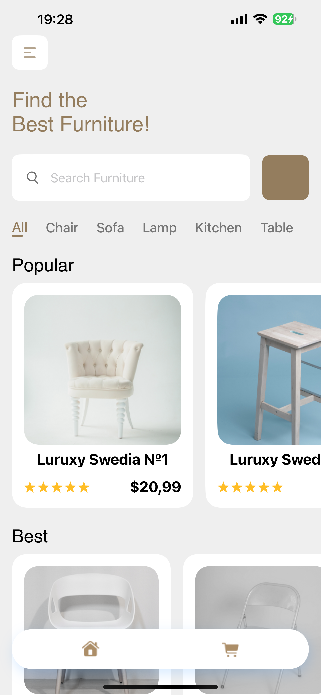
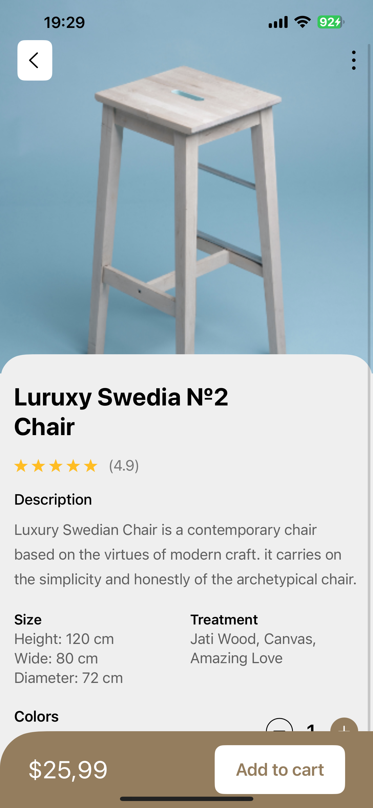
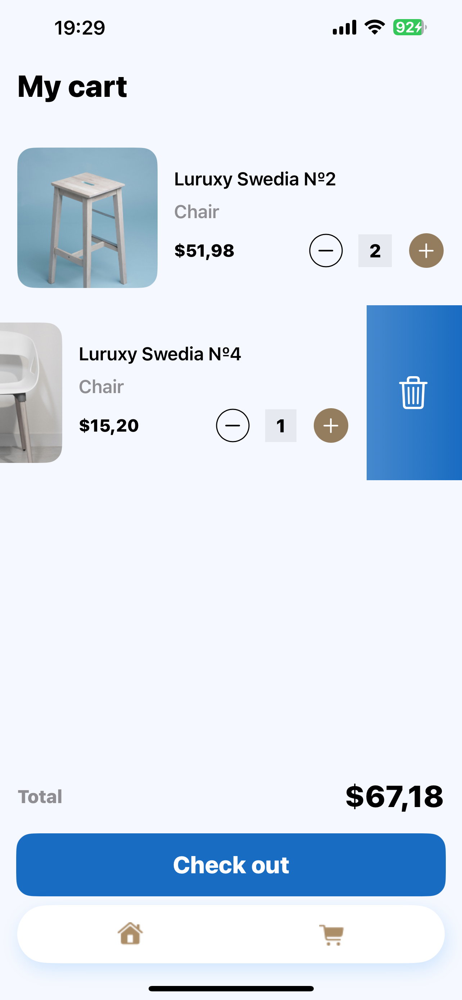

# Furniture-Store
Это моя лабороторная работа по дисциплине ПМИС(программирование мобильных информационных систем) в БГУИРе. Суть лабы в создании какого-то магазина, в моём случае это магазин мебели. Написано на swift и swiftUI для iOS. У пользователя есть возможность просмотра товаров и добавлять их в корзину. Товары храняться статически в глобальном массиве, то есть если приложение перезапустить, то вся корзину обнулиться.
Примечание: если запускаете на iPhone, то при запуске с темной теме цвета в приложении сбиваются.
Для того чтобы скачать приложение нужно либо скачать zip файл, либо создать пустую папку открыть консоль в этой папку и прописать команду "git clone https://github.com/boshiro123/Furniture-Store.git"
Открываете проект в Xcode и запускаете.

